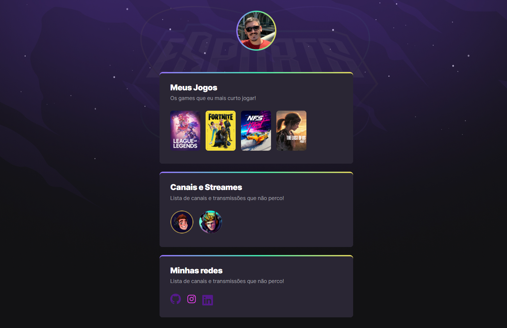

# NLW Explorer

> *Trilha Explorer*

- Projeto construído pelo evento da Rocketseat (Next-Level-Week)

[🔗 Gostaria de ver o resultado? Clique aqui !!](https://alexandremsjr.github.io/NLW-Explorer/)

## Imagens do projeto 👀



### Reponsividade 📱

``` Teste no Iphone SE ```


### Tecnologias utilizadas

- HTML
- CSS
- Git
- GitHub

### 💬 Comentários

``` Se tiver alguma dúvida ou sugestão, deixe sua obersavação no Issues, caso tenha gostado marque uma Star ✨. ```